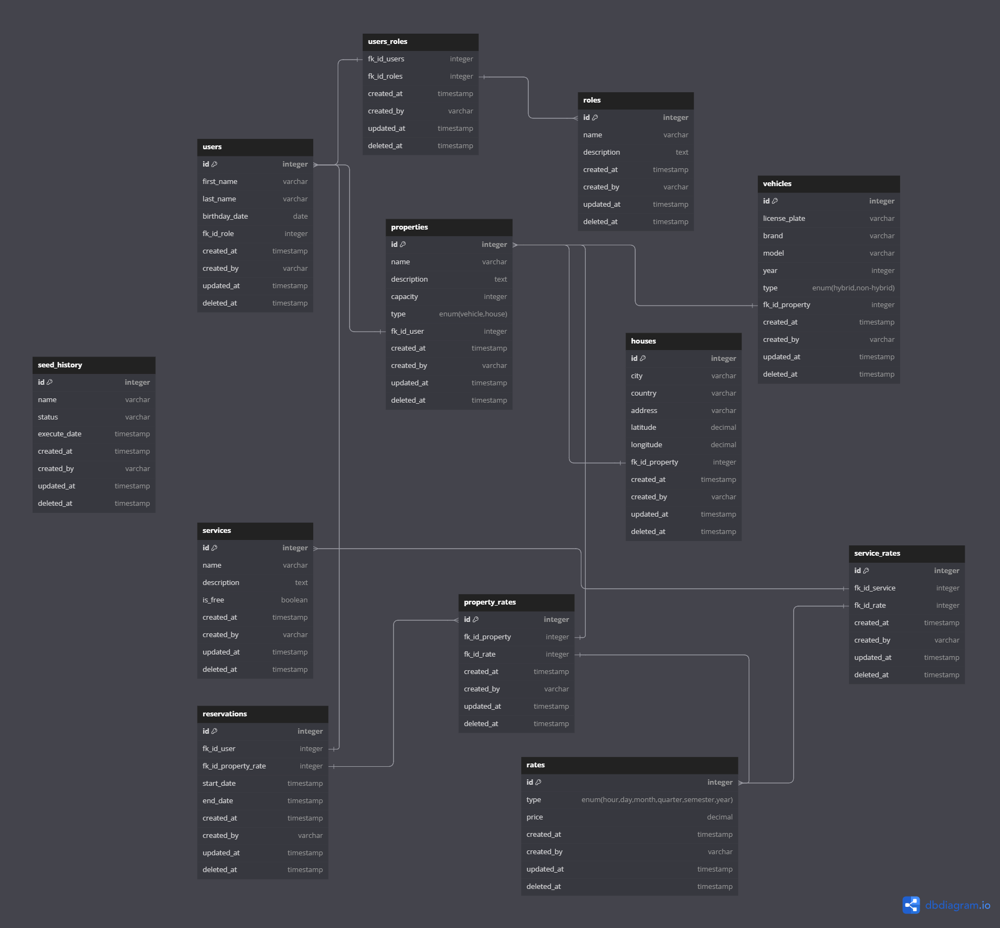

# shiball-admin-api

API del administrativo de Shinball.

---

## 📚 Documentación Interactiva (Scalar + OpenAPI)

La API cuenta con documentación interactiva impulsada por **Scalar** y especificación **OpenAPI 3.0** generada en tiempo real a partir de los esquemas de **Zod**.

### Acceso a la documentación (Modo Desarrollo)

Por seguridad, la documentación está activa **únicamente en modo desarrollo** (o si la variable `ENABLE_DOCS="true"` está presente en el entorno):

- **Interfaz visual interactiva (Scalar)**: [http://localhost:3001/reference](http://localhost:3001/reference)
- **Especificación OpenAPI (JSON crudo)**: [http://localhost:3001/openapi.json](http://localhost:3001/openapi.json)

> En entornos de producción (`NODE_ENV="production"` sin `ENABLE_DOCS="true"`), estas rutas no se montan y devuelven `404 Not Found`.

---

## 🛠️ Guía para Desarrolladores: Cómo documentar un nuevo módulo o endpoint

Para documentar endpoints reutilizando tus esquemas y tipos de TypeScript/Zod sin duplicar código, sigue estos 3 pasos:

### Paso 1: Enriquecer los esquemas Zod (`*.schemas.ts`)

En el archivo de esquemas de tu módulo (por ejemplo `server/api/properties/properties.schemas.ts`), importa `../../config/zod-extend` y usa `.openapi(...)` para añadir metadatos y ejemplos:

```typescript
import '../../config/zod-extend';
import { z } from 'zod';

export const createPropertySchema = z
  .object({
    name: z
      .string()
      .min(2)
      .openapi({
        example: 'Cancha Sintética Principal',
        description: 'Nombre descriptivo de la propiedad',
      }),
    price: z
      .number()
      .positive()
      .openapi({ example: 45.0, description: 'Precio de alquiler por hora' }),
  })
  .openapi('CreatePropertyInput');
```

### Paso 2: Crear el archivo OpenAPI del módulo (`*.openapi.ts`)

Crea un archivo `[modulo].openapi.ts` (por ejemplo `server/api/properties/properties.openapi.ts`) y define una función exportada para registrar las rutas:

```typescript
import { OpenAPIRegistry } from '@asteasolutions/zod-to-openapi';
import { z } from 'zod';
import { createPropertySchema } from './properties.schemas';
import { ErrorResponseSchema } from '../../config/openapi';

export function registerPropertiesDocs(registry: OpenAPIRegistry) {
  registry.registerPath({
    method: 'post',
    path: '/api/properties',
    tags: ['Properties'],
    summary: 'Crear una nueva propiedad',
    description: 'Registra una nueva propiedad deportiva en el catálogo.',
    security: [{ cookieAuth: [] }, { bearerAuth: [] }], // Opcional, si requiere autenticación
    request: {
      body: {
        description: 'Datos necesarios para la propiedad',
        content: {
          'application/json': { schema: createPropertySchema },
        },
      },
    },
    responses: {
      201: {
        description: 'Propiedad creada exitosamente',
        content: {
          'application/json': {
            schema: z.object({
              message: z
                .string()
                .openapi({ example: 'Propiedad creada con éxito' }),
              data: createPropertySchema,
            }),
          },
        },
      },
      400: {
        description: 'Error de validación o datos incompletos',
        content: {
          'application/json': { schema: ErrorResponseSchema },
        },
      },
    },
  });
}
```

### Paso 3: Registrar el módulo en `server/config/openapi.ts`

En [`server/config/openapi.ts`](file:///c:/Users/oscar/Documents/proyectos/shiball-admin-api/server/config/openapi.ts), importa la función del nuevo módulo y regístrala dentro de `registerAllModules()`:

```typescript
import { registerPropertiesDocs } from '../api/properties/properties.openapi';

function registerAllModules() {
  if (isModulesRegistered) return;
  registerAuthDocs(registry);
  registerPropertiesDocs(registry); // 👈 Agregar aquí
  isModulesRegistered = true;
}
```

---

# Database


